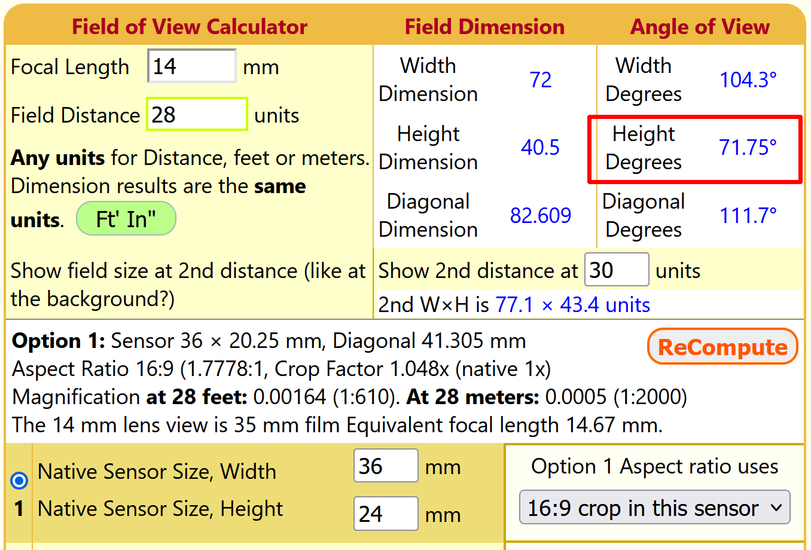
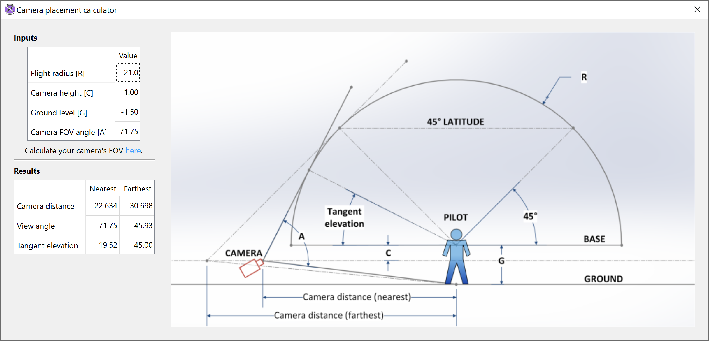

##################
Placing the Camera
##################

Camera placement is important for capturing quality video of a Stunt flight. While it is acceptable to place
the camera farther than recommended and capturing the entire flight hemisphere, it is generally preferable to
capture as much of the core of maneuver space as possible by placing the camera closer. This approach
sacrifices the outer edges of the base; but takeoff, level/inverted flight, and landing are not easy to
evaluate in video anyway. The other maneuvers should be the primary focus of video recording.

General Procedure
-----------------

#. Select a location outside the flight circle upwind of the expected maneuvers. This is typically where the
   contest judges stand.  The correct distance of the camera from the center of the circle depends on the
   focal length of your optical system.  Details are discussed :ref:`below <cam-distance-calc>`.
#. Deploy your tripod at the selected location. Weigh it down if possible so that it remains stable.
#. Mount the camera on the tripod. The result video must be in landscape orientation. If using a mobile
   device, this means that you must orient the device horizontally.
#. Adjust the tripod so that the camera height is approximately between 1.0 — 1.5 m (about 3 — 5 ft).
#. Turn on the camera and make sure it is in video mode.  In photo mode the aspect ratio of the image frame
   will likely be different from that of the video, resulting in incorrect alignment.
#. Point the camera approximately at the center of the circle.
#. Tilt the camera upward so that there is a visible margin between the pilot's feet at the center of the
   circle and the bottom edge of the frame.  During this adjustment make sure that the camera is level. Most
   modern cameras have a built-in leveling guide — take advantage of it.
#. Pan the camera so that the frame's vertical centerline aligns with the center of the flight circle.

When the above steps are followed, you will find that the top of the flight hemisphere is near the top of the
frame in your AR videos.  You will also generally find that the center of the frame points somewhat above the
45° elevation at the far side of the hemisphere.  This is usually the desired outcome.

.. _cam-distance-calc:

Determining Camera Distance
---------------------------

When you don't know the focal length of your camera system, the camera distance must be determined by trial
and error in the field.  However, if you know your system's focal length, we recommend that you use this
`Field of View calculator <https://www.scantips.com/lights/fieldofview.html#top>`__ to determine your camera
system's **angle of view**.  Look for the value labeled "Height" in degrees, in the section "Angle of View":

If documentation for your lens is available, verify that your result is reasonably close to the
manufacturer's listed specifications.

VideoF2B includes a calculator for estimating the camera distance from circle center that will provide the
best video coverage.  To use it, choose :menuselection:`Tools --> Place camera..` in the main menu:

.. hint:: Hover the mouse cursor over the values in the tables for detailed explanations of each value.

Enter the input values to the best of your knowledge:

- The flight radius ``R`` is the distance from the pilot's chest to the centerline of the aircraft.

- The camera height ``C`` is relative to the flight base. For example, if the camera is 1 m above the pilot's
  feet, then ``C = -0.5``.

- Ground level ``G`` is also relative to the flight base.  Under F2B rules, this value in meters is ``-1.50``
  and there should be no reason to adjust it.

- Camera FOV angle ``A`` is the maximum vertical **angle of view** of your camera system as determined above.

As you adjust each input value, the values in the **Results** table will update accordingly.  The values of
interest are in the row labeled **Camera distance**.  These numbers represent the range of recommended
distances for the camera.  Place the camera within this range for best results.

.. danger::

    Please be aware that the outboard wing of the aircraft extends outside the flight hemisphere, and the
    pilot never stays exactly in the center of the circle during a flight.  Do not place the camera too close
    to the flight radius even when the calculated "nearest" distance value is very close to ``R``!

.. hint::

    You may use any suitable distance units for values of ``R``, ``C``, and ``G``, just stay consistent.  The
    default values are in meters.  All angular values are always in degrees.

.. important::

    For safety reasons, **the calculator does not allow the camera inside the flight hemisphere.** That is,
    the calculated "nearest" value of "camera distance" should **never** be less than the flight radius ``R``.
    If you encounter a calculation where this is not true, please submit a bug report with your input values.

With the above precautions in mind, you are ready to produce
:doc:`Augmented-Reality videos </producing-calibrated>`.

.. admonition:: For the technically inclined…

    There are two criteria for camera placement.
    
    The first may be obvious — the center of the flight circle must be visible in the FOV so that users may
    select it during AR processing.  This is shown in the calculator diagram by extending the bottom of the
    FOV angle ``A`` to the point on the ground at the pilot's feet.
    
    The second criterion may not be immediately obvious. It is based on two facts:
    
    #. The "camera cone" formed by the camera's angle of view separates the AR hemisphere into two parts: the
       "near" and the "far" volume.  Image space is represented by integers, resulting in a "dead zone"
       between the two volumes where the aircraft's location cannot be determined.  Whenever the aircraft
       passes through this zone, the motion trace generated by VideoF2B "jumps" across the boundary without
       any information between the two points.  Note that this information is irrelevant during AR processing,
       but it is vitally important during 3D tracking.

    #. The **Overhead Eight** maneuver is critically close to the "dead zone". To minimize the chances of the
       aircraft passing across this boundary during the overhead eight, the calculator ensures that the point
       labeled as "Tangent elevation" on the diagram is never above the 45° elevation of the flight
       hemisphere.  In recorded videos, this criterion enforces a visible gap between the circle of 45°
       elevation (drawn in bright green) and the visible edge of the sphere (drawn in magenta):

       .. image:: images/camera-placement-gap-criterion-sample.png
