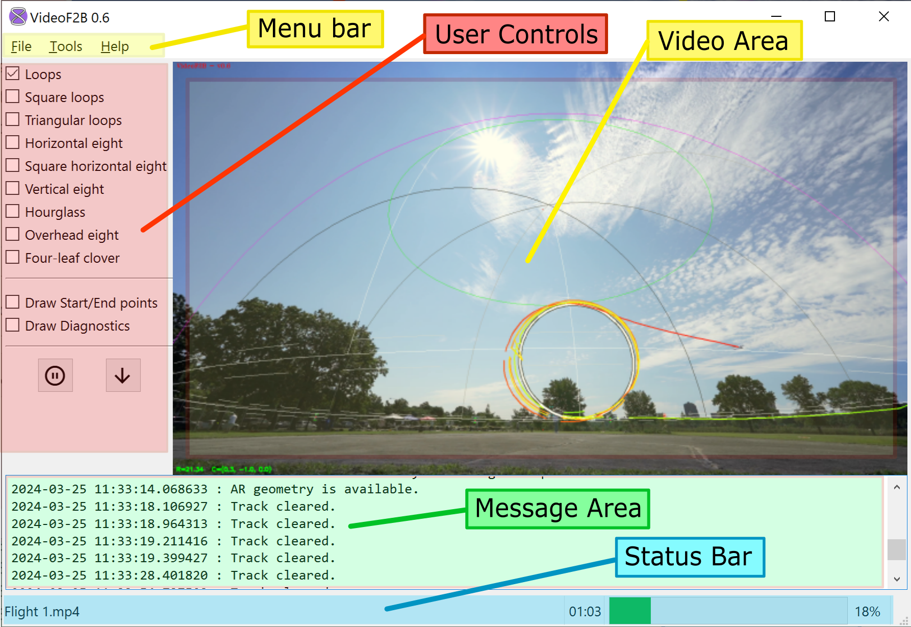

##################
The User Interface
##################

VideoF2B processes one video at a time in the main window.

    The main VideoF2B window

The general areas of the main application window are as follows:

- The **menu bar** at the top provides access to general operations in VideoF2B. Use the :menuselection:`File`
  menu to load videos for processing. The :menuselection:`Tools` menu provides useful tools and calculators.

- **User controls** are enabled when processing :doc:`Augmented-Reality <producing-calibrated>` videos. This
  area is disabled when processing :doc:`Basic <producing-uncalibrated>` videos.

- The **video area** is the largest portion of the main window. It displays the video that is being processed.

- Messages to the user are displayed in the **message area** below the video and user controls. Every message
  is time-stamped with the local date and time of the user's computer.

- The **status bar** along the bottom displays the name of the loaded video file, occasional instructions, the
  elapsed time in the video, and a progress bar.
