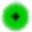

#############
User Controls
#############

This chapter applies to the user controls that are available during
:doc:`Augmented-Reality (AR) processing <producing-calibrated>`.

The following user controls on the left side of the main window are enabled during AR processing:

    .. figure:: images/user-controls-ar.png

        User controls available during AR processing.

VideoF2B reads frames from a given video in strict sequence from beginning to end. The user interface is
designed for an efficient workflow via the keyboard alone, while some of those controls are also available in
the main window, as seen above.

Pausing/Resuming Processing
---------------------------

There is no fast-forward or rewind functionality. However, you can pause the processing at any time by
pressing :kbd:`P` on the keyboard or clicking the |Icon for Pause button| button.  While processing is paused,
you can perform various manipulations of AR geometry, taking as much time as you need. When ready to continue,
press :kbd:`P` again or click the |Icon for Play button| button.

Clearing the Trace
------------------

To clear the trace behind the model aircraft, press :kbd:`Space`. This is useful for presenting clear traces
of maneuvers — clear the trace shortly before an upcoming maneuver to present the traced maneuver clearly.

.. _manipulating-hemisphere:

Manipulating the Flight Hemisphere
----------------------------------

To account for the pilot's movement in the pilot circle during a flight, use the `WASD keys
<https://www.computerhope.com/jargon/w/wsad.htm>`__ to move the flight hemisphere in the :doc:`world XY plane
<world-coordinate-system>`. The keys operate as follows:

    :kbd:`W` moves the hemisphere in **+Y** direction (**forward**, away from the camera).

    :kbd:`S` moves the hemisphere in **-Y** direction (**backward**, toward the camera).

    :kbd:`A` moves the hemisphere in **-X** direction (to the **left**).

    :kbd:`D` moves the hemisphere in **+X** direction (to the **right**).

Every stroke of the above keys moves the hemisphere in the commanded direction by **0.1 m**.

Pressing :kbd:`X` resets the hemisphere's center to the origin of the World Coordinate System.

The flight radius (*R*) is always displayed in the bottom left corner of AR videos. Additionally, when the AR
hemisphere's center (*C*) is not at the origin, its XYZ offset will be displayed next to the flight radius:

    .. figure:: images/sphere-info-overlay.png

        Sphere information in AR video. All dimensions are in meters.

.. tip:: *Compensating for the pilot's off-center displacement*

    Position of the pilot along the X-axis is easy to match accurately. Position along the Y-axis is more
    difficult to estimate because depth is difficult to gauge in video. Take advantage of the **Reverse
    Wingover** maneuver to assess the pilot's initial position.  You will be able to adjust the hemisphere's
    position so that the aircraft's centerline crosses the visible edge of the sphere, while keeping the
    hemisphere's center on the pilot. As the flight proceeds, use your best judgment. Other maneuvers whose
    approaches cross the visible edge of the hemisphere above the base (entry and exit of **Outside Square
    Loops** and entry of **Overhead Eight**) also help to correct for the pilot's position along the Y-axis
    throughout the flight.

To match the :term:`nominal` figure to the maneuver flown by the pilot, use the **arrow keys** to rotate the
hemisphere. The keys operate as follows:

    :kbd:`Left Arrow` rotates the AR hemisphere **counterclockwise** on its vertical axis (i.e., the nominal
    figure moves to the **left** as seen by the pilot).

    :kbd:`Right Arrow` rotates the AR hemisphere **clockwise** on its vertical axis (i.e., the nominal figure
    moves to the **right** as seen by the pilot).

Every stroke of these arrow keys rotates the hemisphere in the commanded direction by **0.5°**.

Displaying Nominal Figures
--------------------------

To toggle the display of any nominal figure, click its corresponding checkbox in the user controls.  You can
also use the :kbd:`Down Arrow` key or the |Icon for Figure Advance| button to advance to the next figure in
the Stunt Pattern sequence.  If no figures are selected in the controls, the advancing function will select
loops.  If one figure is selected, the advance function will unselect the current figure and select the next
figure in the sequence.  If the current figure is the four-leaf clover, the figure selection will remain and
the advancing function will not have any effect.  If more than one figure is selected, the advancing function
will likewise have no effect.

.. note::

    Any combination of nominal figures can be displayed, even if only for
    training and/or demonstration purposes.

Displaying Start/End Points
---------------------------

Every maneuver has a start and an end point for judging purposes, as defined by the FAI F2B Rules. To toggle
the display of start and end points on the displayed nominal figure(s), click the **Draw Start/End points**
checkbox at any time during AR processing:

    .. figure:: images/draw-endpoints-chk.png

        This controls the display of start/end points in displayed figure(s).

The start point is displayed in green |Image for start point|, and the end point
is displayed in red |Image for end point|.

Displaying Diagnostic Points
----------------------------

VideoF2B can optionally display diagnostic points. These are just visual aids for presentation. They are
defined as endpoints of the arcs that make up a figure.  In simple loops, they're at the bottom of the loop.
In more complex figures, diagnostic points help to visualize where the connections between the "straight"
segments and the corners or loops of the figure are located.

To toggle the display of diagnostic points on the displayed nominal figure(s), click the **Draw Diagnostics** checkbox at any time during AR processing:

    .. figure:: images/draw-diags-chk.png

        This controls the display of diagnostic points in displayed figure(s).

Diagnostic points are displayed in alternating green and red colors per figure.  For example, this is the
square horizontal eight with diagnostics displayed:

    .. figure:: images/diagnostic-points.png

        Example: figure with diagnostics enabled.

The start/end points are drawn on top of the diagnostic points in case both options are enabled for display.

