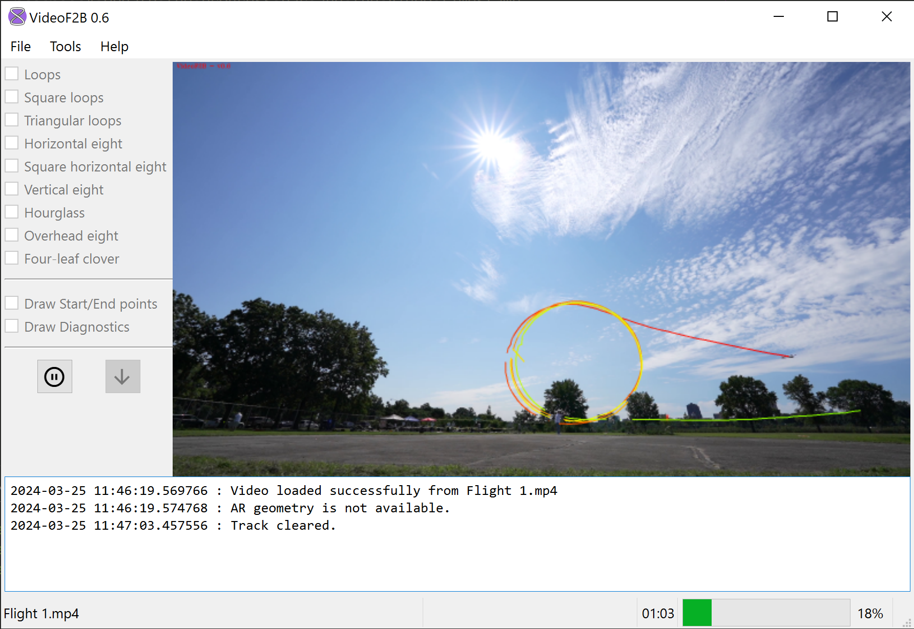
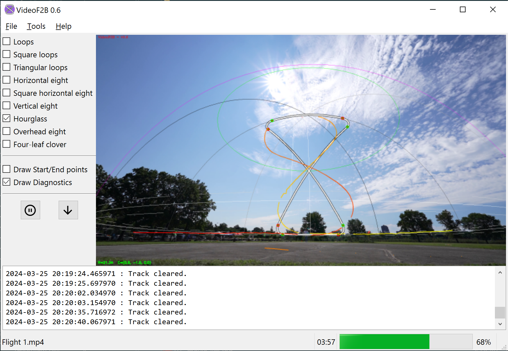

####################
Ways to use VideoF2B
####################

The most prominent feature of VideoF2B is the drawing, or **tracing**, of a path behind a Control Line
aircraft in video. These traces help us to visualize the figures that a Stunt pilot performs during a flight.

There are two general ways you can use VideoF2B to produce videos: `Basic`_, and `Augmented Reality`_.

Basic
-----

This is the simplest use of VideoF2B.  The result is a video where the path of the aircraft is traced with a
colored line.  No additional geometry is drawn.

    Example of Basic video production in progress.

To learn how to produce Basic video, see :doc:`Producing Basic videos <producing-uncalibrated>`.

Augmented Reality
-----------------

In this mode, VideoF2B draws the traced path as well as reference geometry that includes a wireframe of the
:term:`flight hemisphere` and all F2B Stunt :term:`figures <figure>` of the correct shape and size per the
current FAI rules.

    Example of AR video production in progress.

To learn how to produce Augmented Reality video, see
:doc:`Producing Augmented-Reality videos <producing-calibrated>`.
